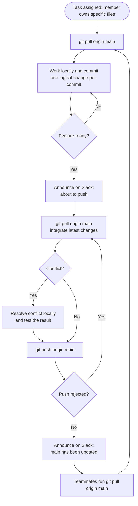

## 1. Workflow and Rationale

Our team chose the Centralized Workflow for our project.

In this workflow, all team members collaborate through one shared GitHub repository. Each developer keeps a local copy of the repository and works independently on their assigned tasks. Developers make commits locally and push their changes to the shared repository.

We chose this workflow because our project is small and developed by several team members working on different requirements. Each member is responsible for specific files, so developers can work simultaneously with a low risk of conflicts. This workflow is simple to apply and does not require the extra overhead of multiple branches.

The main branch will contain the integrated version of the project. Changes are integrated directly into main, and communication between team members (through Slack) helps prevent conflicts and unexpected changes.

## 2. Branch Strategy

Our team will use a single main branch as the central branch of the project.

The main branch contains the current integrated version of the project. Instead of creating a separate branch for each feature or team member, each member is responsible for specific files or parts of the project.

Team members work independently on their assigned files and commit their changes when their work is ready.

## 3. Commit Rules

Each commit should represent one logical change. Developers should avoid putting several unrelated modifications into the same commit.

Commit messages should clearly describe what was changed. Commit messages should be short, clear, and descriptive so that the project history is easy to understand.

## 4. Pull Requests and Review

Our team does not use Pull Requests for integrating changes. Direct pushes to main are allowed.

When a developer finishes a feature, they push their changes to the shared repository. Before pushing, the developer must inform the other team members through Slack or another agreed communication channel. This allows the team to know that new changes are being pushed and helps prevent unexpected conflicts.

After the changes have been merged into the shared branch, the developer informs the team again so that all members are aware that the repository has been updated.

## 5. Merge Strategy

Our team will use Merge to integrate changes. Before pushing, the developer runs `git pull origin main` to merge the latest remote changes into their local work.

If a merge conflict occurs, the developer who is pushing is responsible for resolving it locally and testing the result before pushing to main. If the push is rejected because main has advanced, the developer pulls again and repeats the process.

## 6. Overall Workflow

If a merge conflict occurs, the developer responsible for the branch will resolve the conflict, test the result, and update the Pull Request.
We will use Squash Merge when merging a completed feature, so that the final main history remains clean and each feature can be represented by a clear commit.
